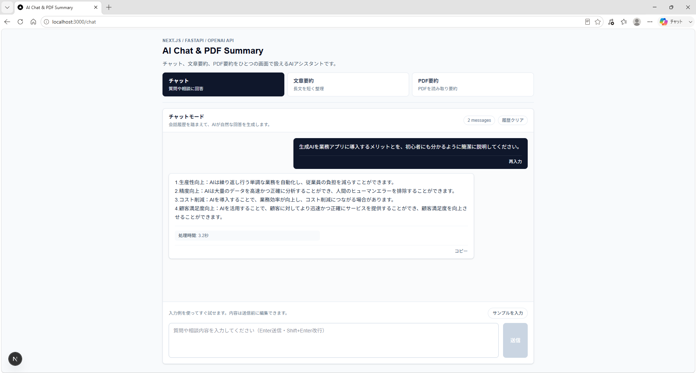
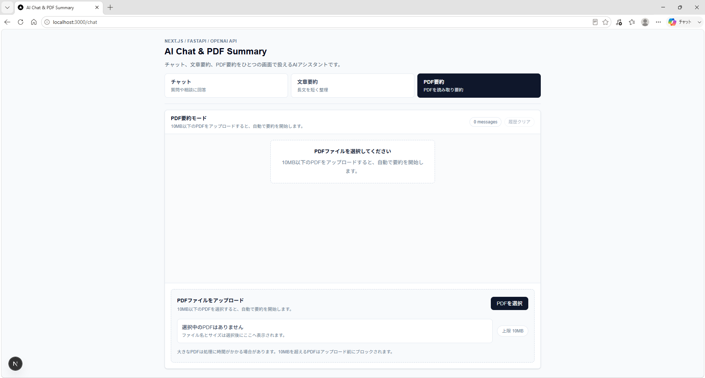
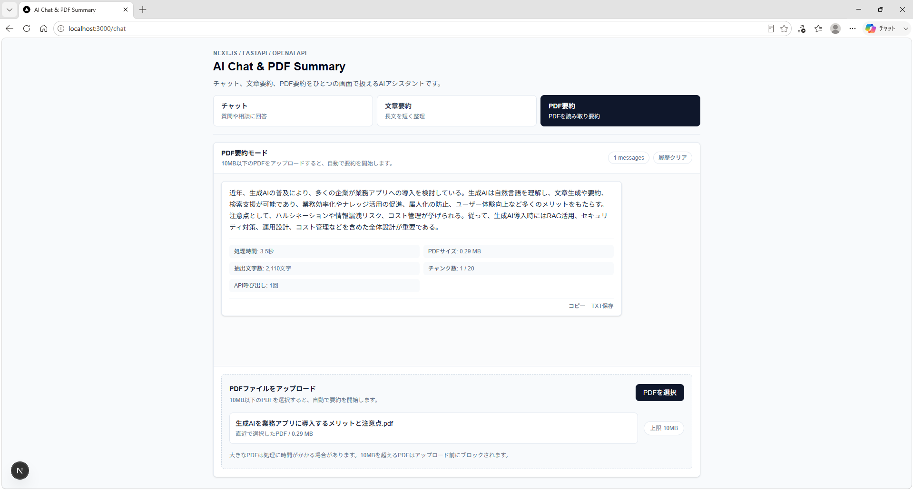

# AI Chat & PDF Summary Frontend

Next.js / TypeScriptで構築した、OpenAI API連携アプリのフロントエンドです。

FastAPIバックエンドと連携し、チャット、文章要約、PDF要約を1つの画面から操作できます。PDF要約では、長文PDFを安全に扱うためのファイルサイズ制限、処理状態表示、処理メタ情報の可視化に対応しています。

OpenAI APIキーはバックエンド側でのみ管理し、フロントエンドには公開しない構成です。

## スクリーンショット

### チャットモード



### PDF要約モード



### 処理メタ情報の表示



## 主な機能

- チャットモード
- 文章要約モード
- PDF要約モード
- PDFアップロードと自動要約
- 10MB超過PDFの事前ブロック
- PDFファイル名とサイズの表示
- AI回答のコピー
- PDF要約結果のTXT保存
- チャット履歴クリア
- サンプル入力
- 過去入力の再入力
- 処理メタ情報表示
- APIエラー表示
- 処理中の二重操作防止
- Backend起動状態の確認
- Renderスリープ復帰中の起動待ち画面表示

## UI/UX改善

このアプリでは、生成AIアプリとして使いやすく見えるようにUIを改善しています。

- `/` から `/chat` へリダイレクト
- アプリ名、説明、技術ラベルを含むヘッダー
- チャット / 文章要約 / PDF要約のセグメント型モード切替
- モード別の空状態、placeholder、ローディング文言
- user / assistant / error のメッセージ表示分離
- PDFアップロード専用パネル
- ファイルサイズ上限とエラーの明示
- Backend起動待ち中の専用パネル表示
- disabled / hover / focus 状態の整理
- `dangerouslySetInnerHTML` を使わない安全なテキスト表示

## Backend起動待ち

Vercel上のFrontendからRender上のBackendを利用する場合、Renderの無料プランなどでは一定時間アクセスがないとBackendがスリープすることがあります。

`/chat` 画面の初期表示時に `NEXT_PUBLIC_API_URL/health` へ接続確認を行い、Backendが応答するまで起動待ち画面を表示します。

確認仕様:

- 1回の接続確認タイムアウト: 5秒
- 再試行間隔: 3秒
- 最大待機時間: 90秒
- 成功条件: `/health` がHTTP 200系かつ `success: true` を返すこと
- 起動待ち中はチャット送信とPDFアップロードを行わない
- 最大待機時間を超えた場合はエラー表示と再試行ボタンを表示

この確認リクエストは、Renderでスリープ中のBackendを起動するトリガーも兼ねます。

本番環境での確認結果:

- Backendスリープ中の初回アクセスで、接続確認パネルから起動待ちパネルへ切り替わる
- 起動待ち中は経過時間と試行回数が表示される
- Backend起動完了後、自動的に通常チャットUIへ切り替わる
- 通常チャットUIへ切り替わった後、チャット機能が利用できる
- Renderプロジェクトをpauseした状態では、最大待機時間後に接続失敗パネルと再試行ボタンが表示される
- Renderプロジェクトをresumeした後、再試行ボタンから接続OKルートへ復帰できる

## AI処理の見える化

バックエンドから返される `data.meta` を使い、AI処理の情報を画面上に表示します。

チャット・文章要約では、主に以下を表示します。

- 処理時間

PDF要約では、以下の情報を表示します。

- 処理時間
- PDFサイズ
- 抽出文字数
- チャンク数
- OpenAI API呼び出し回数

これにより、長文PDFをチャンク分割して処理していることが、ユーザーにも分かる画面になっています。

## APIレスポンス形式

バックエンドは標準化されたJSONレスポンスを返します。

成功時:

```json
{
  "success": true,
  "data": {
    "message": "AIからの回答または要約結果",
    "meta": {
      "mode": "pdf-summary",
      "elapsed_ms": 12345,
      "file_size_bytes": 1048576,
      "extracted_text_chars": 42000,
      "chunk_count": 12,
      "max_chunks": 20,
      "openai_call_count": 13
    }
  },
  "error": null
}
```

エラー時:

```json
{
  "success": false,
  "data": null,
  "error": {
    "code": "PDF_FILE_TOO_LARGE",
    "message": "PDFファイルサイズが大きすぎます。10MB以下のPDFをアップロードしてください。"
  }
}
```

フロントエンドでは `data.message` をメッセージ本文として表示し、`data.meta` が存在する場合は処理情報として表示します。

## コンポーネント設計

肥大化していた `src/app/chat/page.tsx` を分割し、状態管理と表示責務を整理しています。

```text
src/app/chat/
├─ page.tsx
├─ types.ts
├─ constants.ts
├─ utils.ts
└─ components/
   ├─ ModeSelector.tsx
   ├─ MessageList.tsx
   ├─ MessageBubble.tsx
   ├─ BackendWakePanel.tsx
   ├─ PdfUploadPanel.tsx
   └─ ChatInput.tsx
```

各ファイルの主な責務:

| File | Responsibility |
| --- | --- |
| `page.tsx` | 状態管理、API呼び出し、画面全体の組み立て |
| `types.ts` | 共通型定義 |
| `constants.ts` | モード定義、PDFサイズ上限、Backend接続確認設定 |
| `utils.ts` | APIレスポンス変換、タイムアウト付きfetch、ファイル名生成、表示用フォーマット |
| `ModeSelector.tsx` | モード切替UI |
| `MessageList.tsx` | メッセージ一覧、空状態、ローディング表示 |
| `MessageBubble.tsx` | メッセージ単体表示、コピー、TXT保存、再入力、メタ情報表示 |
| `BackendWakePanel.tsx` | Backend接続確認中、起動待ち中、接続失敗時の表示 |
| `PdfUploadPanel.tsx` | PDFアップロードUI、ファイル情報、アップロードエラー表示 |
| `ChatInput.tsx` | テキスト入力、サンプル入力、送信ボタン |

## システム構成

```text
Browser
   |
   v
Next.js Frontend
   |
   | NEXT_PUBLIC_API_URL
   v
FastAPI Backend
   |
   v
OpenAI API
```

## 使用技術

- Next.js 15
- React 19
- TypeScript
- Tailwind CSS
- Fetch API

## セットアップ

Windows PowerShellでの起動例です。

```powershell
cd C:\dev\GItHub\fastapi_app\chat-summary-app
npm install
```

`.env.local` を作成します。

```env
NEXT_PUBLIC_API_URL=http://localhost:8000
```

Frontendを起動します。

```powershell
npm run dev
```

ブラウザで開きます。

```text
http://localhost:3000/chat
```

`/` にアクセスした場合も `/chat` へリダイレクトされます。

## Backend起動

別ターミナルでFastAPIバックエンドを起動します。

```powershell
cd C:\dev\GItHub\fastapi_app\fastapi-gpt-app
.\venv\Scripts\Activate.ps1
uvicorn main:app --reload
```

バックエンド側では `.env` に `OPENAI_API_KEY` が必要です。

```env
OPENAI_API_KEY=your_openai_api_key
```

## npmが認識されない場合

Codexのサイドパネルなどで `npm` がPATHにない場合は、既に `node_modules` がある環境で以下のようにNext.jsを直接起動できます。

```powershell
cd C:\dev\GItHub\fastapi_app\chat-summary-app
& "C:\Users\gan01\.cache\codex-runtimes\codex-primary-runtime\dependencies\node\bin\node.exe" .\node_modules\next\dist\bin\next dev
```

## 動作確認項目

- `/chat` が表示される
- `/` から `/chat` に遷移する
- Backend起動済みの場合、通常画面が表示される
- Backend停止時またはスリープ復帰中に起動待ち画面が表示される
- Backend接続確認がタイムアウトした場合、再試行ボタンが表示される
- 再試行ボタンからBackend復帰後の通常画面へ戻れる
- チャットモードでAI回答が表示される
- 文章要約モードで要約結果が表示される
- PDF要約モードでPDFをアップロードできる
- 10MB超過PDFでエラーが表示される
- PDFファイル名とサイズが表示される
- 処理メタ情報が表示される
- AI回答をコピーできる
- PDF要約結果をTXT保存できる
- 履歴クリアできる
- サンプル入力できる
- 過去入力を再入力できる
- Backend停止時に接続エラーが表示される

## ポートフォリオでのアピールポイント

- Next.jsからFastAPI Backendを呼び出す生成AIアプリ
- OpenAI APIキーをFrontendに持たせない安全な構成
- チャット、文章要約、PDF要約の3モード対応
- 長文PDFをチャンク分割して要約するBackendと連携
- Renderのスリープ復帰を考慮したBackend起動待ちUIを実装
- PDFサイズ制限、テキスト量制限、チャンク数制限に対応
- APIレスポンス形式を `success / data / error` に統一
- 処理メタ情報を表示し、AI処理の透明性を向上
- AI出力のコピー、TXT保存、再入力など再利用性を強化
- UI/UX改善により、実用アプリとしての操作性を向上
- コンポーネント分割により、保守性と拡張性を改善

## 今後の改善予定

- PDFドラッグ&ドロップ対応
- PDF要約の進捗表示強化
- チャット履歴の永続化
- 処理メタ情報の詳細表示切替
- コンポーネントのテスト追加
- BackendのCORS設定を本番向けに制限
- Renderスリープ復帰時間に応じた待機時間チューニング
- デプロイ手順の整備
